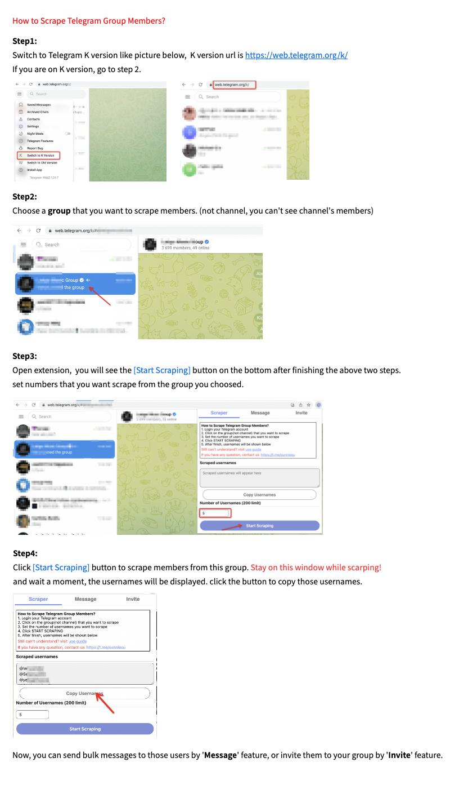

# 🚀 TG Sender PRO

<div align="center">


**The Ultimate Telegram Automation Tool**

[](https://chrome.google.com/webstore)
[](https://github.com)
[](LICENSE)

*Scrape members, send bulk messages, invite users, and automate replies — all from your browser.*

</div>

---

## ✨ Features

### 🔍 Member Scraper
- Scrape Telegram group members with one click
- Filter by activity (24h, 7 days online)
- Remove admins from results
- Export to CSV format
- API Scraper for **100x faster** results

### 📤 Bulk Messaging
- Send messages to multiple users at once
- Support for usernames, phone numbers, and group names
- Customizable delay intervals
- Attach images, videos, and files

### 👥 Bulk Inviter
- Invite scraped members to your groups/channels
- Web Inviter and API Inviter modes
- Configurable invite limits and delays

### 🤖 Auto Reply
- Monitor keywords in incoming messages
- Auto-send predefined responses
- Multiple keyword support (up to 5)
- One-reply-per-contact mode

### 📊 Multi-Account Management
- Manage multiple Telegram accounts
- Switch between accounts easily
- Organize your messaging campaigns

---

## 📋 Usage Guide

### Scraping Members
1. Open Telegram Web and select a group
2. Set the number of members to scrape
3. Click **Start Scraping**
4. Copy the results or export to CSV

### Sending Bulk Messages
1. Paste your target usernames (one per line)
2. Enter your message content
3. Set the interval (20-25 seconds recommended)
4. Click **Start Messaging**

### Inviting Members
1. Select your target group/channel
2. Paste usernames to invite
3. Set interval and invite limit
4. Click **Start Inviting**

---

## ⚠️ Safety Tips

To avoid account bans:

- Use accounts registered **more than 15 days** ago
- Limit daily messages to **under 50**
- Avoid including **links** in messages
- Stay on the page during automated tasks
- Use longer intervals between actions

---

## 🛠️ Installation

1. Download or clone this repository
2. Open Chrome and go to `chrome://extensions/`
3. Enable **Developer mode** (toggle in top right)
4. Click **Load unpacked**
5. Select the project folder
6. Pin the extension to your toolbar for easy access

---

## 📁 Project Structure

```
TG_Sender_PRO/
├── manifest.json          # Extension configuration
├── popup.html/js          # Main popup interface
├── popup_bulk.html/css/js # Bulk messaging interface
├── content-script.js      # Injected Telegram scripts
├── background.js          # Service worker
├── _locales/              # Multi-language support (40+ languages)
├── imgs/                  # Screenshots and resources
└── icons/                 # Extension icons
```

---

## 🌐 Supported Languages

| Languages |
|---|
| English, 中文 (简体/繁体), 한국어, 日本語, Tiếng Việt, ภาษาไทย, العربية, Türkçe, Français, Deutsch, Español, Português, Italiano, Pусский, हिन्दी, and more... |

---

## 📷 Screenshots

<div align="center">




</div>

---

## 🤝 Contributing

Contributions are welcome! Please feel free to submit issues or pull requests.

---

## 📄 License

MIT License - feel free to use and modify.

---

<div align="center">

**Made with ❤️ for Telegram power users**

*Cr4ck version by Rikixz • Version 3.5.2*

</div>